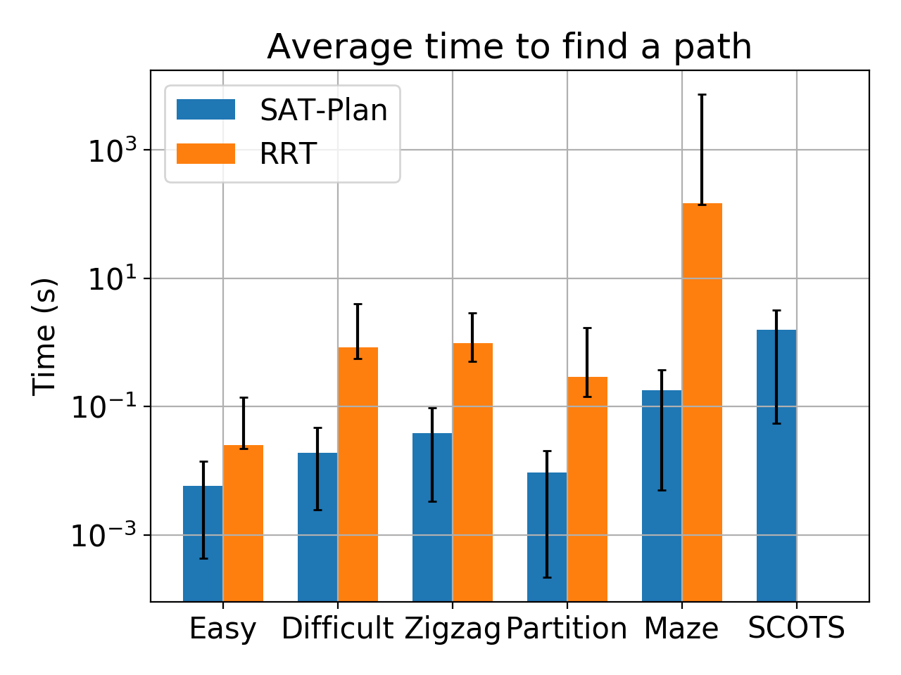
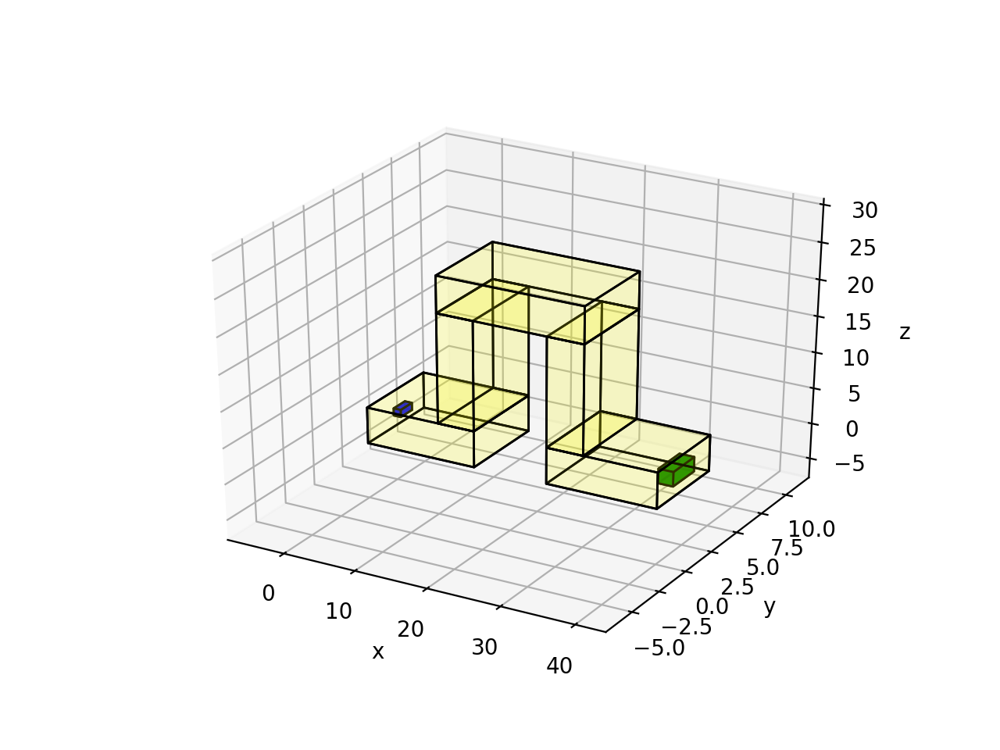

# FACTEST Framework

FAst ConTrollEr SynThesis (FACTEST) is a framework for *controller synthesis for nonlinear systems in complex environments*. You can find links to related publications [here](https://kmmille.github.io/FACTEST/). The controller synthesis problem requires an agent, such as a mobile robot or a quadcopter, to reach a goal (green set) starting from a set of initial configurations (blue), while avoiding obstacles (red). 

This repository serves as the accompanying artifact evaluation package for the CAV2020 paper.


## Requirements
FACTEST has been tested with Python3 on Ubuntu 16.04 and macOS 10.15 (Catalina).

The following libraries are used in FACTEST. You may have to use the `--user` option in the following. 
1. Yices - installation instructions can be found [here](https://github.com/SRI-CSL/yices2_python_bindings). For macOS first install `brew install SRI-CSL/sri-csl/yices2` then `pip3 install yices`.
2. TuLiP Polytope
`pip3 install polytope`
3. Pypoman
`pip3 install pypoman`
4. NumPy
`pip3 install numpy`
5. SciPy
`pip3 install scipy`
6. Matplotlib
`pip3 install matplotlib`

## Using the repository

This articact can be run by either downloading the zip folder for this repository or by downloading the VM. If you choose to run the artifact by downloading the zip file, be sure that all the requirements are installed. Everything is run from the root folder.

## Using the VM

The VM can be downloaded from <https://uofi.box.com/v/FACTESTDownload>. The instructions for using the VM can be found at <https://uofi.box.com/v/FACTESTInstructions>. The username for the VM is `FACTEST` and the password for the VM is `factest2020`.

Once the VM is downloaded, open the terminal and use the following command:

```
cd Desktop\FACTEST
```

## Running FACTEST

### Running all FACTEST Scenarios from CAV2020 paper

In table 1, there is a list of scenarios that FACTEST is tested on.
If you would like to run all the FACTEST scenarios, then run the following command:

```
python3 factest_all.py --plot [bool]
```

This will run all the scenarios. The results for all the scenarios will be saved to a file called `results/synthesis-results/all_data.csv`. If `--plot True` is used, then each of the figures will be saved to a figure called `results/figures/modelname_envname.png`. Note that plotting may take a few minutes. The default value of `--plot` is False.

### Running Specific Scenarios

To run these scenarios, navigate to the FACTEST folder and run the FACTEST python file using the following command:

```
python3 factest.py [modelname] [envname] --segs [int] --plot [bool]
```


### `modelname`
The models that run in the 2D workspace are `car` and `robot`. The models that run in the 3D workspace are `hovercraft` and `auv`.

### `envname`
The environments in the 2D workspace are `zigzag1`, `zigzag2`, `zigzag3`, `barrier`, `maze`, and `SCOTS`. The environments in the 3D worspace are `ztunnel` and `ltunnel`.

### `--segs [int]`
This gives the maximum number of line segments to find a path. In table 1, the maximum number of line segments in 10 for every scenario except the SCOTS scenario. For this scenario, the maximum number of line segments should be set to 100. If unspecified, the maximum number of line segments will default to 100.

### `--plot [bool]`
This specifies whether or not the scenario will be plotted. If `True`, then a plot showing the scenario, reference trajectory, and actual trajectory will be shown.

The results of the scenario will be saved to a file called `results/synthesis-results/modelname_envname.csv`. If you choose to plot the scenario, then it will be saved to a figure called `results/figures/modelname_envname.png`.

For example, if you want to save the results of the car model in the maze environment, with 10 maximum line segments and no plot, the following command would be run:

```
python factest.py car maze --segs 10 --plot False
```

The results from this scenario will be saved in a file called `car_maze.csv`.

## RRT vs. SAT-Plan Comparison

The results from figure 5 can can also be replicated. In order to do this, run the following command:

```
python3 path_comparison.py --env [envname] --plot [bool]
```

### `--env envname`
The environments in the 2D workspace are `zigzag1`, `zigzag2`, `zigzag3`, `barrier`, `maze`, and `SCOTS`. The environments in the 3D worspace are `ztunnel` and `ltunnel`.

If no env is specified or if `envname` is chosen to be `all`, then all the scenarios are run. Note that it takes more than 15 minutes to run all the scenarios.

### `--plot [bool]`
This specifies whether or not the results will be plotted. If `True`, then a plot comparing the iterations and time for the scenario will be created. These plots will be saved to `results/figures/envname_time_comparison.png` and `results/figures/envname_iter_comparison.png`

The `SCOTS` scenario is not run using RRT since it would take over an hour to run the file. We didn't report the runtime for the `SCOTS` scenario using RRT.

The results of the scenarios are saved to two files called `results/RRTvSAT-Plan/RRT_envname.csv` and `results/RRTvSAT-Plan/yices_envname.csv`.

## Reported Results
The results reported are shown below:

|Model      |Env     |Initial Set Size|# Obstacles|Time  |# Partitions|
|:---------:|:------:|:--------------:|:---------:|:----:|:----------:|
|car        |zigzag1 |0.200           |9          |0.028 |1           |
|car        |zigzag2 |0.400           |9          |0.144 |4           |
|car        |zigzag3 |0.600           |9          |0.605 |16          |
|car        |maze    |0.200           |22         |0.078 |1           |
|car        |barrier |0.707           |6          |0.415 |22          |
|car        |SCOTS   |0.070           |19         |0.667 |1           |
|robot      |zigzag1 |0.200           |9          |0.025 |1           |
|robot      |zigzag2 |0.400           |9          |0.196 |4           |
|robot      |zigzag3 |0.600           |9          |0.612 |16          |
|robot      |maze    |0.200           |22         |0.079 |1           |
|robot      |barrier |0.707           |6          |0.498 |22          |
|robot      |SCOTS   |0.070           |19         |0.635 |1           |
|auv        |ztunnel |0.866           |6          |0.372 |1           |
|auv        |ltunnel |0.866           |8          |0.317 |1           |
|hovercraft |ztunnel |0.866           |6          |0.472 |1           |
|hovercraft |ltunnel |0.866           |8          |0.140 |1           |

The results from the RRT vs. SAT-Plan are shown below:  



Up to now you can replicate all results reported in the paper.

## Creating your own scenarios

You can create your own scenarios using FACTEST. Either a new environment can be created or a new vehicle model can be added. If a new environment is created, any of the existing models can be used as long as the workspaces match (i.e. ground vehicle models on 2D workspaces and aerial/underwater vehicle models on 3D workspaces). If a new model is created, then any of the existing environments can be used as long as the workspaces match. After the new scenario is created, merely import the files into the FACTEST file to run. Note that it is much simpler to create new 2D workspace environments.

### New environments
New environments can be created for FACTEST. To create an environment, the following functions are necessary:

1. `problem()`: This function returns the obstacles, initial set, and goal as a triple `(obstacles, Theta, goal)`. The obstacles, initial set, and goal set are all represented as polytopes. A polytope `{x | Ax <= b}` is represented as a pair `(A, b)`.

The obstacles are given as a list of polytopes `[(Ao1, bo1), ... , (Aon, bon)]`. The inital set is given as `(A0, b0)`, and the goal set is given as `(Af, gf)`. Note that the initial set must be a rectangle in order for the partitioning to work. The example from the barrier environment is shown below:


```
import numpy as np
from math import *

def problem():
	A_rect = np.array([[-1,0],
			   [1,0],
			   [0,-1],
			   [0,1]])
  # Since all the obstacles are rectangles,
  # the A-matrix is the same for each polytope

	b1 = np.array([[-1.55], [1.9], [-0], [2.0]])
	b2 = np.array([[-1], [2.5], [-2.6], [3.0]])
	b3 = np.array([[0], [4.0], [.1], [0]])
	b4 = np.array([[0], [4.0], [-4.0], [4.1]])
	b5 = np.array([[-4.0], [4.1], [0], [4.0]])
	b6 = np.array([[.1], [0], [0], [4.0]])

	obstacles = [(A_rect, b1),
		     (A_rect, b2),
		     (A_rect, b3),
		     (A_rect, b4),
		     (A_rect, b5),
		     (A_rect, b6)]

	b0 = np.array([[-0.5], [1.5], [-1.5], [2.5]])
	Theta = (A_rect, b0)
  # The initial set must be a rectangle
  # for the partitioning to work

	bf = np.array([[-3], [3.675], [-3], [3.675]])
	goal = (A_rect, bf)

	return obstacles, Theta, goal
```

This will generate an environment as the following, where obstacles are red regions and regions outside the borders, initial set is the blue region, and the goal set is the green region:  


2. `plot_problem()` (3D Workspace only): This is only required for plotting scenarios in the 3D workspace since it is difficult to see the scenarios with many obstacle polytopes. This function will plot the safe space (complementary of the obstacles) that the system must travel through. Examples can be seen in `Ltunnel.py` and `ztunnel.py` in the `envs` folder. Note that you do not need this function if you do not need to plot the 3D Workspace scenarios.

```
import matplotlib.pyplot as plt
from mpl_toolkits import mplot3d
from util.plot_polytope3d import *
import numpy as np

def plot_problem():
	fig = plt.figure()
	axes = fig.add_subplot(111, projection='3d')

	obstacles, Theta, Goal = problem()

	A_cube = np.array([[-1, 0, 0],
		           [1, 0, 0],
		           [0, -1, 0],
		           [0, 1, 0],
		           [0, 0, -1],
		           [0, 0, 1]])

	b1 = np.array([[0], [15], [0], [5], [0], [5]])
	b2 = np.array([[-10], [15], [0], [5], [-5], [20]])
	b3 = np.array([[-10], [30], [0], [5], [-20], [25]])
	b4 = np.array([[-25], [30], [0], [5], [-5], [20]])
	b5 = np.array([[-25], [40], [0], [5], [0], [5]])

  # These polytopes correlate to polytopes that fit in
  # the safe space of the l-tunnel

	if axes == None:
		axes = a3.Axes3D(plt.figure())

	plot_polytope_3d(A_cube, b1, ax = axes, color = 'yellow', trans = 0.1)
	plot_polytope_3d(A_cube, b2, ax = axes, color = 'yellow', trans = 0.1)
	plot_polytope_3d(A_cube, b3, ax = axes, color = 'yellow', trans = 0.1)
	plot_polytope_3d(A_cube, b4, ax = axes, color = 'yellow', trans = 0.1)
	plot_polytope_3d(A_cube, b5, ax = axes, color = 'yellow', trans = 0.1)

	plot_polytope_3d(A_cube, Theta[1], ax = axes, color = 'blue', trans = 0.9)
	plot_polytope_3d(A_cube, Goal[1], ax = axes, color = 'green', trans = 0.9)

	axes.set_xlabel('x')
	axes.set_ylabel('y')
	axes.set_zlabel('z')

  # The axes must be returned since the reference and actual
  # trajectories should be plotted on top of the environment

	return axes
```

This will generate an environment as the following, where the safe space (complimentary of the obstacles) is the yellow cubes, initial set is the blue cube, and the goal set is the green cube:  


3. Once the above function(s) is created, they can be imported to FACTEST.py (added in the `Import the environment` part) to run. The following shows how to add the barrier example, which is stored in the `env` folder as `partition2.py` to the main algorithm:
```
elif args.env == 'barrier':
	from envs.partition2 import *
	dim = 2 # The workspace dimension is 2
```

### New models
When creating a new model to be used with factest, there are four functions that must exist:
1. `model(q, t, u)` : This function contains the dynamics of the nonlinear vehicle model. The input to the function is: the state `q`, the time `t`, and the input to the system `u`. The function returns the derivative of the state variables in `q` with respect to time. In other words, the `model(q, t, u)` contains the ODE for the vehicular model. The car model example is shown below:

```
def model(q, t, u):
    x, y, theta = q
    v, w = u

    dxdt = v*cos(theta)
    dydt = v*sin(theta)
    dthetadt = w
    return [dxdt, dydt, dthetadt]
```

2. `controller(q, qref, uref)`: This function contains the control law for the Lyapunov based feedback controller. The input to the function is: the current state of the system `q`, the reference state `qref`, and the reference input `uref`. The output is the input to the system.

Each state in `qref` is given by `[x, y, theta]` for the 2D scenarios, and `[x, y, z, roll, pitch, yaw]` for the 3D scenarios. Each input in `uref` is given by `[v, w]` for the 2D scenarios and `[v, [wx, wy, wz]]` for the 3D scenarios. These states and inputs can be converted to the states and inputs needed for your system. For example, the robot model has the states `x, y, cos(theta), sin(theta)`. In the controller, the states given by `qref` are converted to the necessary states.

The Lyapunov based feedback controller for the car example is shown below:

```
def controller(q, qref, uref):
	x, y, theta = q
	xref, yref, thetaref = qref
	vref, wref = uref

  # These controller parameter are defined globally
	k1, k2, k3 = k

  # Compute the error
	xe = cos(theta)*(xref - x) + sin(theta)*(yref - y)
	ye = -sin(theta)*(xref - x) + cos(theta)*(yref - y)
	thetae = thetaref - theta

  # Control law
	v = vref*cos(thetae) + k1*xe
	w = wref + vref*(k2*ye + k3*sin(thetae))

	return [v, w]
```

3. `bloating(n, alpha)`: This is the function that computes the amount that the size of each obstacle is increased by as each line segment is added. The equation used in this section is computed from the Lyapunov based feedback controller (see Lemma 2 and Lemma 3 in the paper). The way that this equation is explained in Section 4.3. The number of the line segment is given by `n+1` and the size of the initial sublevel set given by the initial set is `alpha`. The function returns a number that the obstacles are increased by. The example for the car model is shown below:

```
def bloating(n, alpha):
	k1, k2, k3 = k
	if n != 0 and n != 1:
		return sqrt(alpha**2 + 4*n/k2)
	else:
		return sqrt(alpha**2 + 4/k2)
```

4. `run_model()`: This function runs the model that you created using the reference controller computed by FACTEST. The inputs to the function are: the initial state `q0`, the array of timestamps `t`, the array of reference states `qref`, and the array of reference inputs `uref`. The output is the solution to the system.

```
def run_model(q0, t, qref, uref):
	q = [q0]
	u0 = [0, 0]
	for i in range(0,len(t)):
		t_step = np.linspace(t[i-1], t[i], 11)
		q1 = odeint(model, q0, t_step, args = (u0,))
		q0 = q1[1]
		q.append(q0)
		u0 = controller(q0, qref[i], uref[i])
	return q
```
